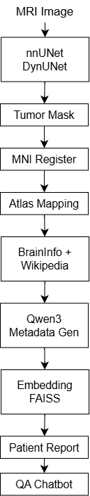
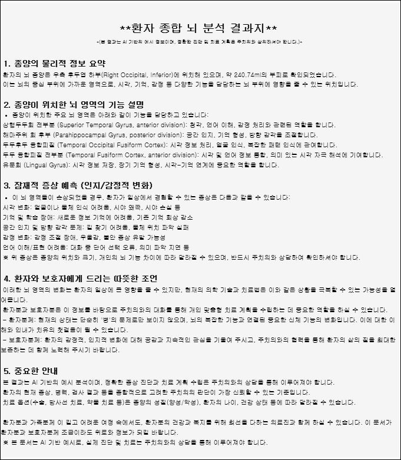
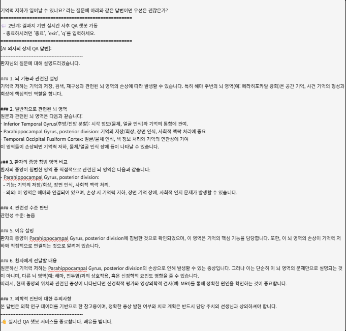

# Brain Tumor Segmentation & Neuroanatomical RAG System

## Key Contributions
- Brain tumor segmentation using nnUNet / DynUNet
- Clinical-aware evaluation beyond Dice score
- Atlas-based neuroanatomical interpretation
- Brain region knowledge base construction using Qwen3-14B
- Neuroanatomical Retrieval-Augmented Generation (RAG)
- Patient-friendly report generation and QA system

## 📌 프로젝트 개요
본 프로젝트는 뇌종양 분할(Segmentation) 결과를 단순 Dice Score로 평가하는 것을 넘어, 종양이 실제로 어느 뇌 영역에 위치하는지 해석하고, 해당 뇌 영역의 기능 정보를 기반으로 환자 맞춤형 결과지와 질의응답(QA)을 제공하는 것을 목표로 한다.
기존 연구들이 Segmentation 정확도 향상에 집중했다면, 본 프로젝트는 다음과 같은 관점에 집중하였다.

* 임상적 해석 가능성 (Clinical Interpretability)
* 설명 가능한 의료 AI (Explainable AI)
* 환자 친화적 정보 제공
* Neuroimaging + LLM + RAG 융합

## 📌 프로젝트 목표
* nnUNet, DynUNet 기반 뇌종양 Segmentation 수행
* Dice 중심 평가의 한계 분석
* Atlas 기반 해부학적 위치 분석
* 뇌 영역 지식베이스 구축
* 환자 맞춤형 결과지 생성
* Neuroanatomical RAG 기반 QA 시스템 구축

## 📌 전체 파이프라인

MRI → Tumor Segmentation → Atlas Mapping → Brain Knowledge Base → RAG QA

MRI 영상으로부터 종양을 분할하고, Atlas 기반 해부학적 분석을 수행한 뒤,뇌 영역 지식베이스와 RAG를 결합하여환자 맞춤형 결과지와 QA 서비스를 제공하는 End-to-End Neuroimaging AI Pipeline

## 📌 Segmentation 모델
### 사용 모델
* nnUNet
* DynUNet
* UNet
* AttentionUNet
* SwinUNETR

### 데이터셋
* MSD Brain Tumor Dataset
* BRATS Format

### 전처리
* nnUNet Preprocessing Pipeline
* ANTs 기반 MNI152 Registration

## 📌 평가 지표

| 지표              | 설명                   |
| --------------- | -------------------- |
| Dice            | Segmentation Overlap |
| HD95            | Boundary Accuracy    |
| Volume Error    | 종양 부피 차이             |
| Center Distance | 종양 중심 위치 오차          |
| Atlas Overlap   | 해부학적 위치 분석           |

## 📌 주요 결과

### 1. Dice는 비슷하지만 임상 결과는 다름
* nnUNet vs DynUNet
* Dice Score는 유사
하지만
* HD95 차이 존재
* Volume Error 증가
* 위치 오차 발생

### 2. 과도한 Segmentation
| Class | GT (ml) | Pred (ml) |
| ----- | ------- | --------- |
| WT    | 36.49   | 240.74    |
| TC    | 27.40   | 188.12    |
| ET    | 3.37    | 51.02     |

실제보다 최대 6배 이상 크게 예측되는 사례 확인

### 3. 위치 오차
* Center Distance 약 27 voxel

Dice가 높아도 실제 종양 위치는 크게 벗어날 수 있음을 확인

### 4. Atlas 기반 분석
종양 중심 위치
* Right Occipital (Inferior)
실제 주요 침범 영역
1. Superior Temporal Gyrus, anterior division
2. Parahippocampal Gyrus, posterior division
3. Temporal Occipital Fusiform Cortex
4. Temporal Fusiform Cortex, anterior division
5. Lingual Gyrus

중심 위치와 실제 종양 분포 영역이 일치하지 않을 수 있음을 확인

## 📌 Brain Knowledge Base 구축
Harvard-Oxford Atlas의 48개 뇌 영역에 대해

### 데이터 수집
* Wikipedia
* BrainInfo

### 자동 메타데이터 생성
Qwen3-14B를 이용하여
* Overview
* Anatomical Location
* Major Functions
* Network Tags
* Functional Tags
* Clinical Tags
를 구조화된 JSON 형태로 생성하였다.

예시 기능 태그
* Memory
* Language
* Emotion
* Executive Function
* Social Cognition
* Visual Processing
* Decision Making

## 📌 Neuroanatomical RAG 시스템
구축된 Brain Knowledge Base를 기반으로
* SentenceTransformer Embedding
* FAISS Vector Search
를 수행하였다.

### 환자 질문 예시
* 기억력 저하가 발생할 수 있나요?
* 얼굴을 잘 알아보지 못하겠어요.
* 감정 조절이 어려워질 수 있나요?
* 언어 기능에 문제가 생길 수 있나요?

### QA 동작 방식
1. 질문과 관련된 뇌 영역 검색
2. 환자의 종양 침범 영역 추출
3. 두 영역 간 관련성 비교
4. 관련성 수준 판단
* 높음
* 중간
* 낮음
5. 환자 친화적 설명 생성

## 📌 환자 맞춤형 결과지 생성

Atlas 분석 결과와 Brain Knowledge Base를 이용하여 자동으로 결과지를 생성한다.

## 📄 Patient Report Example

## 💬 Neuroanatomical RAG QA Example

포함 정보
* 종양 위치
* 주요 침범 영역
* 기능 설명
* 잠재적 증상
* 환자 및 보호자 안내

이를 통해 MRI 결과를 비전문가도 이해할 수 있는 형태로 변환하였다.

## 📌 핵심 인사이트
> Dice Score가 높다고 해서 임상적으로 신뢰할 수 있는 결과는 아니다.

본 프로젝트는
* Volume Error
* Spatial Error
* Atlas-based Interpretation
* Explainable AI
관점의 중요성을 확인하였다.
또한
MRI → Tumor Segmentation → Atlas Mapping → Brain Knowledge Base → RAG QA
까지 연결되는 End-to-End Neuroimaging AI Pipeline을 구축하였다.

## 📌 향후 계획
* Explainable Brain Region Visualization
* Multi-Atlas 지원
* Clinical Validation
* Multi-modal LLM 적용

## 🧩 사용 기술
### Medical Imaging
* PyTorch
* MONAI
* nnUNet
* DynUNet
* ANTs
* Nibabel
* Nilearn

### Brain Atlas
* Harvard-Oxford Atlas
* MNI152

### NLP / LLM
* Qwen3-14B
* Ollama

### Retrieval
* SentenceTransformers
* FAISS

### Data Sources
* Wikipedia API
* BrainInfo

### Development
* Python
* Jupyter Notebook 
